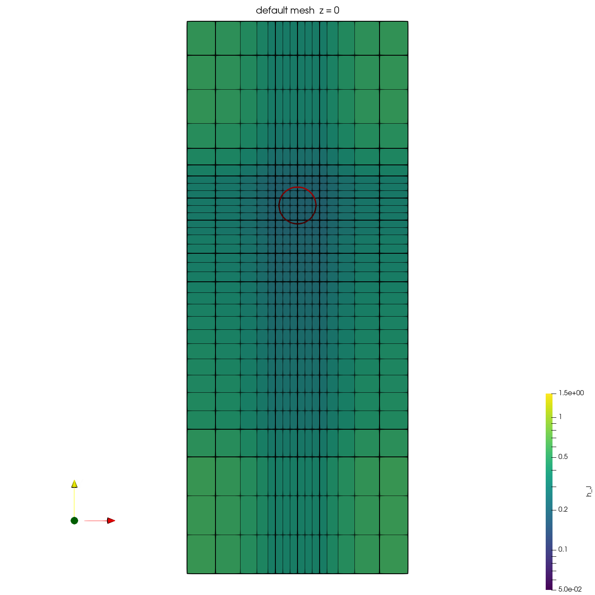
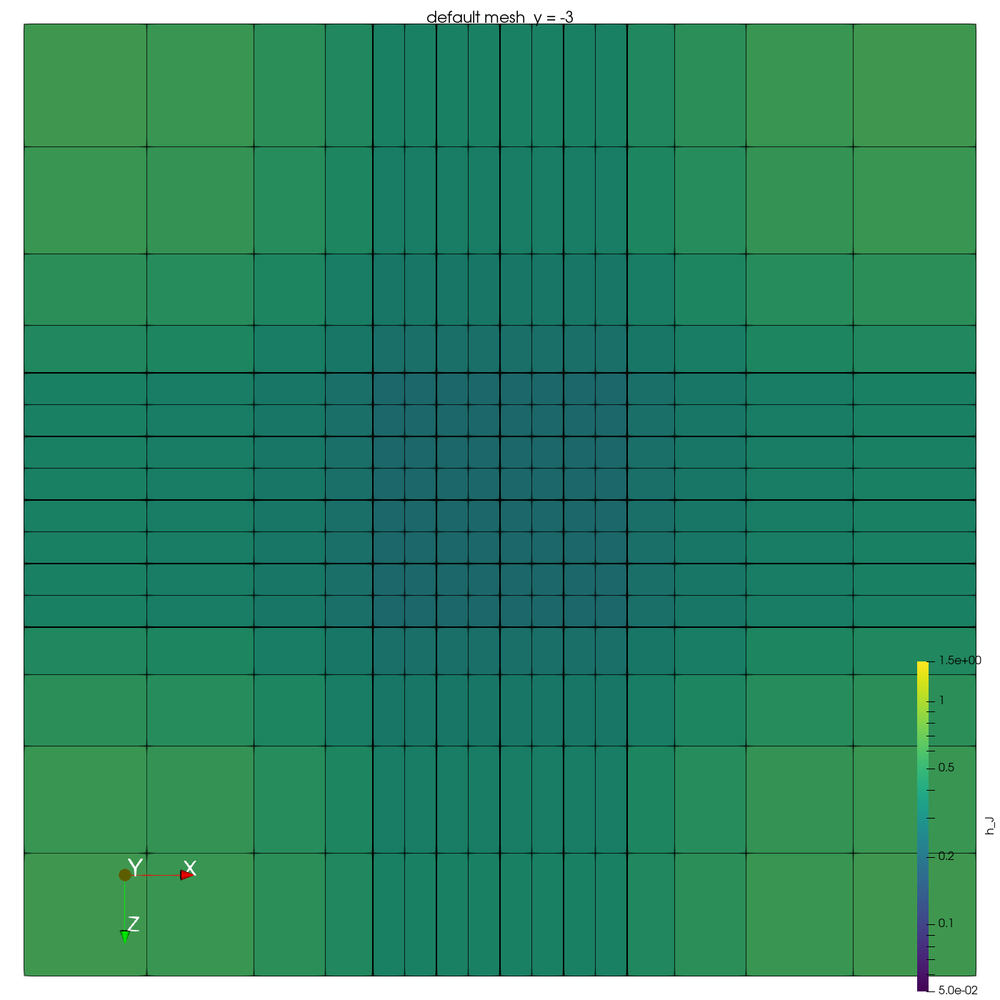
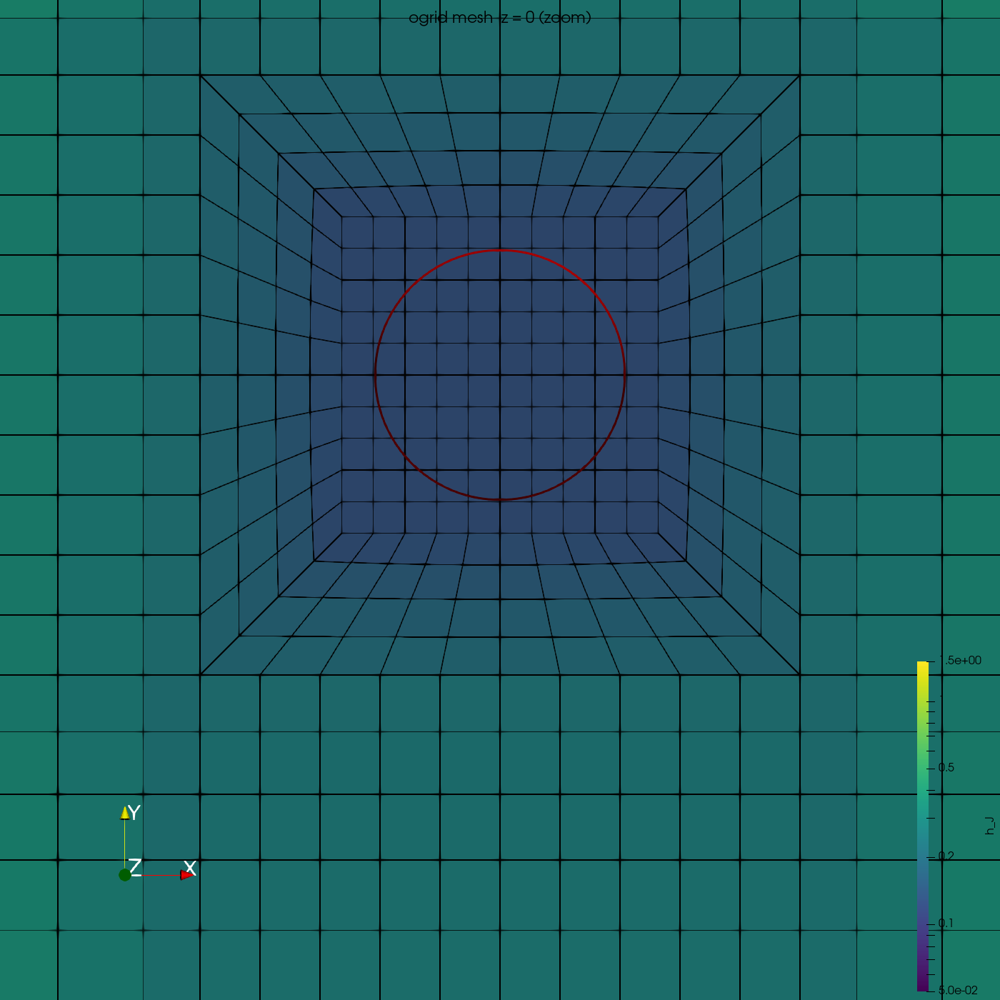
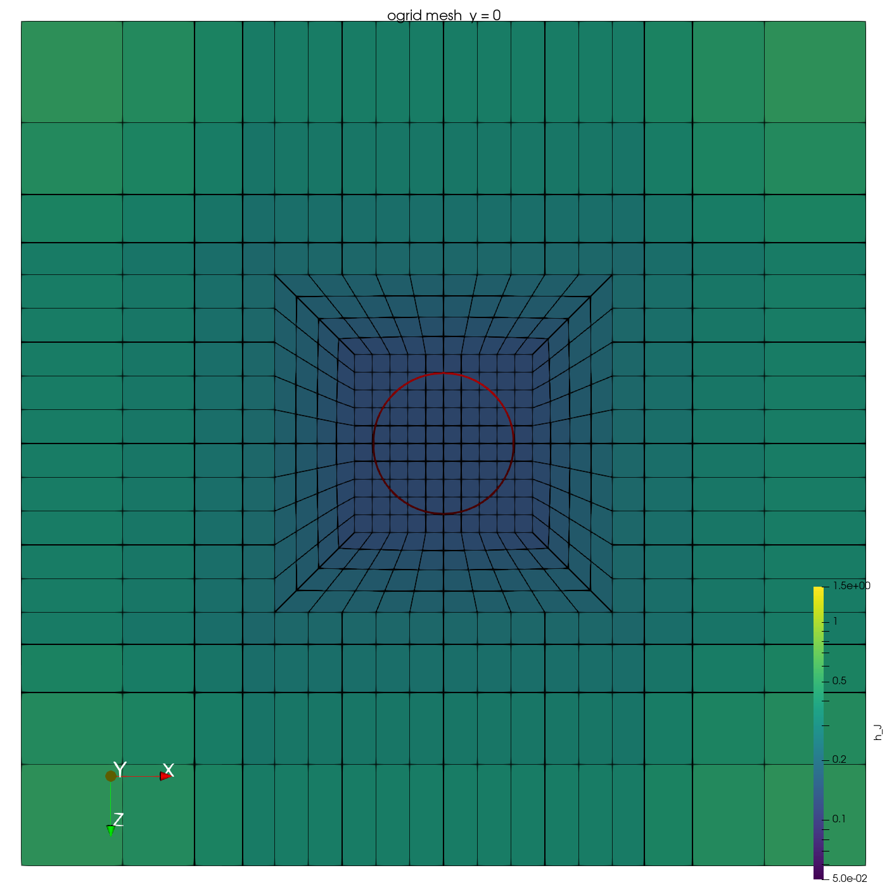

# pid-centering-3D

3D version of `gpu/pid-centering`: a spherical bubble (D = 1) held at the
origin by a PID controller that accelerates the reference frame, in an open
domain. Liquid (saturated, c = 1) enters at the top at the frame velocity and
leaves at the bottom; x and z are periodic. The physics, PID, boundary
conditions and species treatment (passive c, CST off, hard sink, budget
`mdot`) are the 2D case's; see its README. What is new here is the mesh,
generated with gmsh instead of genbox, refined at the bubble interface and in
the wake and coarse elsewhere.

The PID controller (`../common/pid.hpp`) and the animation script
(`../common/animate.py`) are shared with the 2D case. The UDF finds `pid.hpp`
through the case directory, so run the case inside the repository checkout,
or copy `gpu/common` next to the case directory.

Status: mesh generation is done and checked, and each mesh type has run a few
steps of the full case at N = 3 on the laptop (below). The case has not been
run at N = 7, so `dt` and the level-set settings in `bubble.par` are derived
from the mesh but not yet validated.

## Mesh

```
nekls                              # NEKRS_HOME etc.
PYTHON=~/venv/bin/python ./mesh    # default preset
./mesh --preset ogrid --W 8        # a preset plus overrides
```

`./mesh` runs `generate_mesh.py` (gmsh, all arguments passed on), converts
`bubble.msh` to `bubble.re2` with gmsh2nek (xmin/xmax and zmin/zmax made
periodic), and runs `check_mesh.py` on both. It stops on any failed target,
gmsh2nek error or periodic mismatch.
- `PYTHON` must have gmsh and numpy (tested with gmsh 4.15).
- `GMSH2NEK` defaults to `gmsh2nek` on `PATH`; build it with
  `cd Nek5000/tools && ./maketools gmsh2nek`.
- A run takes 5-8 s for the Cartesian presets and ~40 s for the O-grid ones
  (layout search), with a peak memory of 0.3 GB or less.
- Safety limits: `generate_mesh.py` refuses layouts above `max_elements`
  (200k) and caps its address space at `max_memory_gb` (8). An earlier
  version of the O-grid search could run away and exhaust memory, which on
  WSL stops the whole distro.

Outputs:
- `bubble.msh`: Hexahedron 27, msh 2.2.
- `bubble.re2`.
- `bubble.plan.json`: the parameters, the 1-D node distributions, the element
  count and the derived nekRS-LS settings (`nekrs_ls`: interfaceWidthValue,
  capillary and advective dt estimates, Hmax/Hmin).

Open `bubble.msh` in the gmsh GUI to look at the mesh.

Boundary IDs are the order of the physical groups: 1 inflow (top), 2 outflow
(bottom), then xmin, xmax, zmin, zmax. gmsh2nek pairs the last four as
periodic but leaves their IDs on the faces, and nekRS takes the number of
boundary IDs as the largest ID on any face ("lookup of bid 5 failed").
`bubble.usr` therefore clears the IDs of the periodic faces.

### Layout

Default (`core = cartesian`), a z = 0 cut:

```
  y = +5   +------+-------------+------+  inflow (ID 1)
           |      :  upstream   :      |  graded to <= h_far
   +0.8    +------+-------------+------+
           | side |  fine cube  | side |  uniform 0.2 cubes over the
           |      |     (o)     |      |  interface shell r <= 0.75
   -0.8    +------+-------------+------+
           |      | wake column |      |  0.2 across; streamwise 0.25 to
           |      |             |      |  y = -1.5, ramp to 0.5 at y = -5,
           |      :             :      |  0.5 to y = -6, then graded
  y = -10  +------+-------------+------+  outflow (ID 2)
          -3    -0.8          +0.8     3  x and z periodic
```

It is one global tensor product of three 1-D node distributions. Every
element is an axis-aligned brick, sizes grow by at most 1.5 per element, and
the far field reaches ~1.06.

`core = ogrid` replaces the central block by an O-grid:
- a flat inner cube holds the bubble;
- "bulged cube" layers (spherical caps) lead out to a flat core box;
- the interface cells are finer than the core-box face cells, which set the
  spacing of the wake column and the side blocks.

`generate_mesh.py` has the details and ASCII sketches.

| default, z = 0 | default, y = -3 (wake) |
|---|---|
|  |  |
| **ogrid, z = 0 (zoom)** | **ogrid, y = 0** |
|  |  |

The cut planes show element outlines coloured by h_J (element volume^(1/3));
the red circle is the initial bubble.

### Presets

Default targets:
- Interface zone (elements overlapping 0.3 <= r <= 0.75): edges <= h_iface,
  edge aspect <= 2.
- Wake zone (rho <= 0.75, y from -0.5 to -6): cross-stream edges <=
  h_wake_cross; streamwise 0.25 near the bubble, rising to 0.5 at y = -5.
- Everywhere else: far-field edges <= 1.25, neighbour size ratio <= 1.5,
  minSJ >= 0.5.

The nekRS-LS columns are at N = 7, from `bubble.plan.json`.

| preset | core | elements | GLL points (N = 7) | interface cells | interfaceWidthValue (R/eps) | capillary dt (0.8x estimate) |
|---|---|---|---|---|---|---|
| default | cartesian | 8448 | 4.33 M | 0.2 | 0.0429 (11.7) | 1.8e-3 |
| fine | cartesian, h_iface 0.125 | 23040 | 11.8 M | 0.125 | 0.0268 (18.7) | 8.9e-4 |
| large | cartesian, W 8, Lu 6, Ld 15 | 12312 | 6.30 M | 0.2 | 0.0429 (11.7) | 1.8e-3 |
| ogrid | ogrid, h_iface 0.15 | 13416 | 6.87 M | 0.127 | 0.0271 (18.4) | 9.1e-4 |
| ogrid-fine | ogrid, h_iface 0.1 | 29775 | 15.2 M | 0.089 | 0.0192 (26.1) | 5.4e-4 |

`bubble.par` is set for the default mesh at N = 7:
- `interfaceWidthValue = 0.0429`;
- `dt = 1.5e-3`, about 0.67x the capillary estimate (in 2D, 0.8x was stable);
- TLSR/CLSR every 100/10 steps, capped at 200/80 pseudo-steps.

For another preset, take the values from `bubble.plan.json`. Do not leave eps
at the lvlSet default: it is taken from the largest element, which here gives
eps ~0.12 (R/eps ~4.1, or 0.18 with interfaceWidthFactor = 1.5), and in 2D the
gas core was already unstable at R/eps = 5.9.

### Why the default core is Cartesian

Three topologies were built and checked against the same targets, and two
independent reviews compared them:
- **A:** an O-grid core with columns and an H-grid box.
- **B:** a sphere-in-box derived from `gpu/rigid/generate_mesh.py`, with the
  sphere interior filled and a frame of trapezoid blocks out to a periodic box.
- **C:** a Cartesian tensor product.

At the default targets all three need 7-9k elements (B 7266, C 8448, A 8592).
C is numerically the easiest:
- Its interface cells are all identical 0.2 cubes, so eps is exactly
  1.5 h/N all along the interface.
- Its smallest element is the interface cell, so it has the largest capillary
  dt (1.8e-3 vs 1.2e-3 for A and 6.9e-4 for B) and the smallest Hmax/Hmin
  (4.3), which sets the reinit pseudo-step counts.
- Its advective CFL limit is 2-4x less restrictive, because the O-grids'
  sheared corner cells set theirs.
- Every element is affine, so nekRS's FDM-based Schwarz smoother is exact.

B's hand-tuned shells put small sheared cells (h_J 0.105) right on the
interface path. The O-grid pays off at finer interface resolution:
- For 0.15-0.16 cells a tensor product needs 14-16k elements, against 13.4k
  for `--preset ogrid`, which reaches 0.127.
- Its cells are sized for the level set, not the wake column.

In both cores the fine spacing of the central block runs out to the periodic
walls in thin "arms". In the default mesh 84% of the elements are outside the
interface and wake zones, with edge aspect up to 5.3.
- Replacing the x/z arms by trapezoid frame blocks (as in B) would save an
  estimated ~25% but makes the far field non-affine.
- The fine y-layers are inherent to any layered block mesh.

## Smoke tests (laptop, GTX 1050, N = 3)

Each mesh ran 40 steps (t = 0-0.1) of the full case: level set, PID, c with
the hard sink and the budget output, dt = 2.5e-3, eps from 1.5 h/N at N = 3.

- **default:** 8448 elements, 2 boundary IDs, x/z periodic. Scaled Jacobian
  1.0, 1.5 GB of GPU memory, CFL 0.08, stable.
- **ogrid:** 13416 elements with 14400 curved edges. Scaled Jacobian at the
  GLL points >= 0.64, 2.4 GB of GPU memory, CFL 0.03, stable; the gas volume
  is 0.61.

The gas volumes are larger than the sphere's 0.52 because eps is large at
N = 3 (0.1 and 0.063).

At N = 7 the default mesh has 4.3 M GLL points, so it needs a cluster GPU.
From the smoke test (1.5 GB for 0.54 M points at N = 3) that is roughly
10-12 GB of GPU memory. A field file is ~120 MB, so `checkpointInterval` is
0.5.
