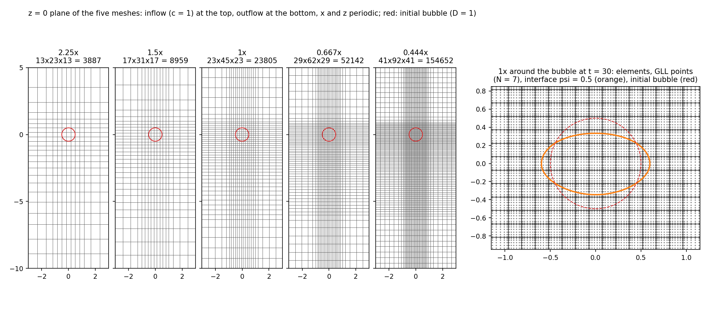
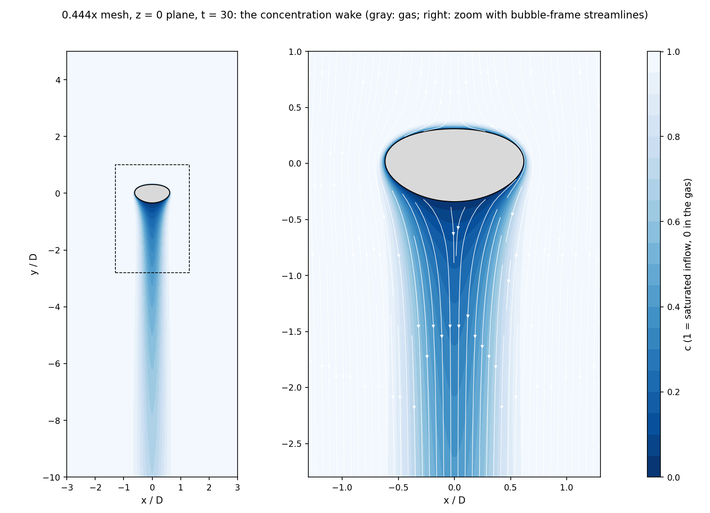

# pid-mesh-sensitivity

Sc = 1 mesh sensitivity study of the Sherwood number, like
`gpu/mesh-sensitivity`, but with the bubble held in place by the PID
controller of `gpu/pid-centering-3D` and fresh liquid flowing in, on graded
gmsh meshes. It uses the same five refinement levels, 2.25x, 1.5x, 1x,
0.667x and 0.444x the Kolmogorov scale, where the level of a mesh is set by
its finest elements (around the bubble).

In `gpu/mesh-sensitivity` the bubble rose through a fully periodic 4x8x4 box
and kept meeting its own species-depleted wake, while a soft source
restored c in the liquid. It then drifted sideways at a time set by
numerical noise, left its depletion trail and Sh rose, so the meshes could
only be compared in windows where all of them were in the same phase. Here
the bubble never meets depleted liquid: the depleted wake leaves through the
outflow, and the liquid enters saturated.

What comes from where:
- Physics, species model and bubble centering from `gpu/pid-centering-3D`
  (see its README and `gpu/pid-centering`'s): a spherical bubble (D = 1)
  held at the origin by a PID controller that accelerates the reference
  frame (`../common/pid.hpp`), in a 6x15x6 domain that is periodic in x and
  z, with the liquid entering at the top at the frame velocity and leaving
  at the bottom. c is a passive scalar with the liquid diffusivity 1/Pe
  everywhere, c = 1 at the inflow and a hard sink (c = 0 where psi < 0.5)
  in the gas; no soft source. mdot comes from the species budget, and
  `MTC = mdot/(area * c_inflow)`, `Sh = MTC Pe`.
- Nondimensional numbers, numerics and job handling from
  `gpu/mesh-sensitivity`: Re = 231.4, Sc = 1 (Pe = 231.4), Fr = 1.633,
  We = 2.667, muratio = 148.1 and the physical density ratio 1/0.0002709 =
  3691; N = 7; the same dt for the same finest element size; TLSR and CLSR
  every 0.01 and 0.001 time units; data.csv every 0.1; the BUBBLE_STOP_AT
  clean stop and the job scripts in `../common`.
- Meshes from `../pid-centering-3D/generate_mesh.py` (the Cartesian core):
  a uniform cube of fine elements around the bubble, a wake column below it,
  and elements that grow by at most 1.5x per element towards the boundaries.

## Meshes

The Kolmogorov scale is lambda_K = 0.0671 mm (lambda_K/d = 0.021536). As in
`gpu/mesh-sensitivity`, the resolution is the mean unique GLL spacing
dx = h/N at N = 7, here of the finest elements, which are cubes of the same
size h = 4/Nk as the uniform elements of the gpu/mesh-sensitivity run of the
same name (Nk x 2Nk x Nk elements). Every size target of the PID case's
default mesh (made for h = 0.2: wake 1.25-2.5 h, far field 6.25 h) is scaled
by h/0.2, so the whole mesh is refined together:

| Run    | h (finest) | dx/lambda_K | fine cube | elements (x y z) | GLL points (E N^3) | uniform mesh of the same h | largest edge | Hmax/Hmin |
|--------|------------|-------------|-----------|------------------|--------------------|----------------------------|--------------|-----------|
| 2.25x  | 4/12       | 2.21        | 7^3, half-width 1.17   | 13x23x13 = 3887   | 1.33M | 3456 (1.19M)   | 1.46 | 2.60 |
| 1.5x   | 4/18       | 1.47        | 9^3, half-width 1.0    | 17x31x17 = 8959   | 3.07M | 11664 (4.0M)   | 1.29 | 3.42 |
| 1x     | 4/27       | 0.98        | 13^3, half-width 0.963 | 23x45x23 = 23805  | 8.17M | 39366 (13.5M)  | 0.77 | 3.87 |
| 0.667x | 4/40       | 0.663       | 17^3, half-width 0.85  | 29x62x29 = 52142  | 17.9M | 128000 (43.9M) | 0.61 | 5.19 |
| 0.444x | 4/60       | 0.442       | 25^3, half-width 0.833 | 41x92x41 = 154652 | 53.0M | 432000 (148M)  | 0.41 | 5.42 |
| 0.296x | 4/90       | 0.295       | 37^3, half-width 0.822 | 57x136x57 = 441864 | 151.6M | 1458000 (500M) | 0.27 | 6.11 |

0.296x was added for the Sc = 4 study (see Running on Frontier).



The z = 0 plane of the five meshes and, on the right, the 1x mesh around the
bubble at t = 30 with its GLL points (`figures.py`).

The fine cube has the generator's cell count (the smallest even number of
cells that covers the interface zone r <= 0.76) plus one, so the bubble centre
lies inside an element. With an even count the centre is an element vertex
and all three axes through it are element edges; there the gas core carries
strong spurious currents at the physical density ratio (u_max up to 7 on the
1.5x mesh at t = 0.5, against 1.4 with the odd count), which then corrupt the
level set along the edges and seed spurious gas in the liquid, and the 2.25x
bubble breaks up at t = 1.7. (In gpu/mesh-sensitivity the bubble rose through
the mesh, so it only passed such points; here the PID holds it in place.)

The interface width is eps = 1.5 h/N ([LVLSET] interfaceWidthValue), which is
what interfaceWidthFactor = 1.5 gives on the uniform meshes; the lvlSet
default would take h from the largest element.

## Numerics

As in `gpu/mesh-sensitivity`, except:
- `customProperties` calls `scalar->mueSVV()`, so the scalar SVV in
  `[SCALAR *]` is active (gpu/mesh-sensitivity's scalars ran without it; see
  `../pid-centering/README.md`).
- `[TLSR]`/`[CLSR] maximumSteps = 200/80`. lvlSet takes the pseudo-time step
  from the smallest element and the distance to cover from the largest, so
  on a uniform mesh its default runs 25 (N + 1) = 200 TLSR and 10 (N + 1) = 80
  CLSR pseudo-steps. On these meshes (Hmax/Hmin 2.9-5.4) that would be
  580-1000 and 230-430, 3-5x the cost, only to redistance the far field.
  The caps keep the uniform-mesh counts, so near the bubble the reinit is
  the same as in gpu/mesh-sensitivity.
- The buoyancy reference density is the liquid's (open domain), not the
  domain average.

Besides the odd fine cube (see Meshes), three changes to the PID case were
needed at the physical density ratio (it had only run at rho ratio 40):
- **Fixed outflow.** The outflow imposes the frame velocity, like the
  inflow, so both fluxes balance exactly and the pressure has no Dirichlet
  boundary. The pressure outflow of `gpu/pid-centering-3D` (zeroNeumann
  velocity, p = 0 with Dong's backflow term) blew up at an outflow node at
  t = 0.073 on the 1x and 0.667x meshes alike, the velocity there growing
  ~500x per step, with either pressure extrapolation order of the rho
  splitting. The wake is still 10 D long before it meets the outflow.
- **No noise in the liquid (psi snap).** After every level set step psi is
  set to 1 wherever 1 - psi < 1e-6 ([CASEDATA] psiSnap). CLSR takes its
  normals from the TLS, which TLSR makes a distance function only within
  ~5 finest elements of the interface (200 pseudo-steps at CFL 0.4, the
  same reach as the default on gpu/mesh-sensitivity's uniform meshes).
  Farther out the normals are arbitrary, and CLSR amplifies the ~1e-7
  deficits the CLS solve leaves in the liquid wherever they diverge, until
  spurious gas pockets form at element edges and vertices and their
  buoyancy blows the run up. Without the snap this happened 1-2 D from the
  bubble on the 0.667x and 0.444x meshes (0.667x: deficit 5e-7 at t = 0.1,
  5e-3 at t = 0.9, blow-up at t = 1.26), and, before the far-field reset
  below, anywhere in the coarse far field (t = 0.35 on 1x, 0.78 on 2.25x;
  with the default reinit caps, which redistance farther, already from
  t = 0.035 near the inflow, where the zero-Neumann TLSR condition bends the
  distance function). The uniform periodic meshes of gpu/mesh-sensitivity
  are fine everywhere and have no boundaries. The real interface tail only
  falls below 1e-6 about 14 eps (3 finest elements) from the interface, so
  the snap removes noise and the outermost tail, which CLSR partly restores
  at every call: data.csv records the volume removed (`snap_removed`,
  ~1.6e-5 per 0.1 time units on 0.667x, i.e. ~1% of the bubble by t = 30,
  in proportion to eps).
- **Pure far-field liquid.** psi is also reset to 1 farther than 2 D from
  the PID setpoint after every level set step, which catches anything
  larger that gets there (the bubble stays within ~0.04 D of the setpoint
  and its interface band within ~1 D). data.csv records the largest deficit
  found there before the reset (`far_deficit_max`, ~1e-7) and the gas volume
  removed (`far_removed`).

`[CASEDATA]` switches for tests: `traceVelocity` and `traceFarField` print
where the largest velocity or the far-field deficit is while they exceed the
given value; `psiSnap = 0`, `farFieldClean`, `rhoSplittingFilter` and
`pressureExtOrder` turn the corresponding features off or on.

| Run    | dt      | TLSR/CLSR every | checkpoints |
|--------|---------|-----------------|-------------|
| 2.25x  | 1e-4    | 100/10 steps    | 0.5         |
| 1.5x   | 1e-4    | 100/10 steps    | 0.5         |
| 1x     | 1e-4    | 100/10 steps    | 0.5         |
| 0.667x | 5e-5    | 200/20 steps    | 1           |
| 0.444x | 2.5e-5  | 400/40 steps    | 1           |
| 0.296x | 1.25e-5 | 800/80 steps    | 1           |

## Running on Polaris

The meshes need a python with gmsh and numpy, and gmsh2nek:

```
python3 -m venv --system-site-packages ~/answinter26/tools/gmsh-venv   # conda python
~/answinter26/tools/gmsh-venv/bin/pip install --pre -i https://gmsh.info/python-packages-dev-nox "gmsh==4.15.0.dev1+nox"
cd ~/Nek5000/tools && bin_nek_tools=~/answinter26/tools ./maketools gmsh2nek
```

(The PyPI `gmsh` wheel needs libGLU, which the Polaris login nodes lack; the
`nox` build of gmsh 4.15, the version `../pid-centering-3D` was tested
with, does not.) Then

```
PYTHON=~/answinter26/tools/gmsh-venv/bin/python GMSH2NEK=~/answinter26/tools/gmsh2nek \
    ./setup-runs.sh ~/answinter26/Sc1-pid
```

makes the five run directories (name:Nk:dt:checkpointInterval specs select
others; SC sets the Schmidt number and END_TIME the end time), each with its
mesh (`bubble.re2`, `mesh.log`, `bubble.plan.json`), and `common/pid.hpp`
next to them for the udf. Meshing takes 5-40 s per run on a login node.

Runs are submitted and restarted with the job scripts in `../common` (see
`../mesh-sensitivity/README.md`), e.g.

```
cd ~/answinter26/Sc1-pid
PROJ_ID=nek-vf QUEUE=prod PREPARE_RESTART=1 <common>/submit-bundle.sh 03:00 \
    0.444x:12 0.667x:4 1x:2 1.5x:1 2.25x:1
```

A restart takes the PID integral and frame velocity from the data.csv row at
the restart time, which the clean stop always writes.

## Running on Frontier

The Sc = 4 study ran on Frontier, with a sixth mesh, 0.296x (Nk = 90: 37^3
fine cells of half-width 0.822, 441,864 elements, 151.6M GLL points,
eps = 0.0095238, dt = 1.25e-5), because the species boundary layer is
thinner than at Sc = 1 by about Sc^-1/2. It used nekRS-LS a48ee9fc5, the
commit of the Sc = 1 runs on Polaris, built with PrgEnv-gnu and
gcc-native/13.2 as in nekRS_HPCsupport/Frontier/install.md, with
`-DENABLE_HYPRE_GPU=off`. (That does not change the pressure solve: nekRS
runs the BoomerAMG coarse solve on the CPU whenever the multigrid coarse grid
is not SEMFEM, on Polaris too.) The PyPI gmsh wheel works on the Frontier
login nodes:

```
module load cray-python/3.11.7
python3 -m venv ~/answinter26/tools/venv
~/answinter26/tools/venv/bin/pip install "gmsh==4.15.*" numpy
SC=4 PYTHON=~/answinter26/tools/venv/bin/python GMSH2NEK=~/Nek5000/bin/gmsh2nek \
    ./setup-runs.sh ~/answinter26/Sc4-pid-prod 2.25x:12:1e-4:0.5 1.5x:18:1e-4:0.5 \
    1x:27:1e-4:0.5 0.667x:40:5e-5:1 0.444x:60:2.5e-5:1 0.296x:90:1.25e-5:1
```

The five shared meshes come out with the element counts above; 0.296x takes
1.5 min.

Jobs are submitted with `../common/submit-bundle-frontier.sh`, the Slurm
counterpart of submit-bundle.sh (same BUBBLE_STOP_AT clean stop,
PREPARE_RESTART and DEPEND chaining, and prepare-restart.sh; a case runs in
one job at a time, so jobs in different partitions can be queued for the
same run and whichever starts first runs it). Frontier
limits batch jobs below 92 nodes to 2 h, so long runs fit best in the
`extended` partition (at most 64 nodes and 24 h, one running job per user;
a second extended job waits for the first and accrues priority meanwhile)
and the rest in chains of 2 h batch jobs, e.g.:

```
cd ~/answinter26/Sc4-pid-prod
PROJ_ID=fus167 PARTITION=extended PREPARE_RESTART=1 <common>/submit-bundle-frontier.sh 24:00 0.296x:56 0.444x:8
A=$(PROJ_ID=fus167 PREPARE_RESTART=1 <common>/submit-bundle-frontier.sh 02:00 0.667x:4 1x:2 1.5x:1 2.25x:1)
B=$(PROJ_ID=fus167 PREPARE_RESTART=1 DEPEND=$A <common>/submit-bundle-frontier.sh 02:00 0.667x:4 1x:2 1.5x:1 2.25x:1)
```

`../common/bundle-status.sh <study dir> <jobid>...` shows the jobs' states
and each case's step, time, CFL, recent s/step and Sh (with `--wait <s>` it
first blocks until a job starts or ends or a log shows an error), and
`../common/step-costs.sh <log>` splits a run's mean s/step into ordinary,
CLSR and TLSR steps.

The `debug` QOS (2 h, one job per user) is for tests only: OLCF does not
allow production work or job chaining there. The bringup (all six meshes,
t = 0 to 1.3-7.9) ran in debug in its own directory, and production started
again from t = 0. GPU-aware MPI (`NEKRS_GPU_MPI=1`, which the Polaris script
uses) aborts the multi-node runs at startup on Frontier ("Memory access fault
by GPU"), so submit-bundle-frontier.sh keeps nrsqsub's default of 0.

Seconds per step on Frontier nodes (8 GCDs each), over the bringup's steps 500
to the end (t up to 1.3-7.9; `ordinary` is a step without reinitialization),
and in production (the coarse runs' second job, t = 4-14; 0.444x and 0.296x
over the 12 h job from t = 13 and 9; 0.296x ran at 0.047 on 64 nodes):

| Run    | Nodes | GLL points/GCD | ordinary | CLSR step | TLSR step | mean (bringup) | mean (production) |
|--------|-------|----------------|----------|-----------|-----------|----------------|-------------------|
| 2.25x  | 1     | 0.17M          | 0.024    | 0.27      | 1.08      | 0.057          | 0.064             |
| 1.5x   | 1     | 0.38M          | 0.032    | 0.36      | 1.47      | 0.076          | 0.091             |
| 1x     | 2     | 0.51M          | 0.042    | 0.43      | 1.80      | 0.095          | 0.113             |
| 0.667x | 4     | 0.56M          | 0.044    | 0.41      | 1.82      | 0.069          | 0.080             |
| 0.444x | 8     | 0.83M          | 0.056    | 0.47      | 2.14      | 0.070          | 0.079             |
| 0.296x | 56    | 0.34M          | 0.037    | 0.30      | 1.35      | 0.041          | 0.048             |

An ordinary step costs about 0.016 s plus 48 ns per GLL point per GCD, so
the small runs are latency-bound and gain little from more nodes. On the
same node counts the coarse runs are 15-30% slower than on Polaris (Sc = 1
production: 0.048, 0.074, 0.096 and 0.070 s per step from 2.25x to 0.667x).

`submit-animate-frontier.sh` is the Slurm counterpart of submit-animate.sh
(post.csv and animation.mp4, see Output), with ParaView 5.13.1 (OSMesa) from
the Frontier software stack. Its Python has no numpy, so PV_SITE names a
directory with one (`pip install --target ~/answinter26/tools/pv-site
'numpy<2'` with cray-python/3.11.7), and Frontier has no ffmpeg, so FFMPEG
names a static build:

```
cd ~/answinter26/Sc4-pid-prod
PROJ_ID=fus167 FFMPEG=~/answinter26/tools/ffmpeg PV_SITE=~/answinter26/tools/pv-site \
    <dir>/submit-animate-frontier.sh 01:00 \
    "2.25x:2:Sc = 4, 2.25x Kolmogorov (3887 elements)" ... \
    "0.296x:4:Sc = 4, 0.296x Kolmogorov (441864 elements)"
```

Each run gets a CPU node, whose cores and memory its chunks share. The
script selects VTK's STDThread backend, because that ParaView defaults to
Sequential, which is about 10 times slower (a 0.444x frame of
`../common/animate.py` took 7 min serially, 30 s on 56 cores). pvbatch runs
without MPI, each chunk as a task of one srun step, since animate.py reads
whole checkpoints.

## Output

data.csv has one row every 0.1 time units and at each job's last step:
- `mdot`, `MTC`, `Sh`: interface transfer from the species budget over the
  row's interval (see `../pid-centering/README.md`);
- `mdot_sink`, `Sh_sink`: the same from what the hard sink zeroed, which is
  how gpu/mesh-sensitivity measured mdot; with BDF2 it reads low;
- `total_area`, `c_bulk`, `c_min`, `c_max`, `gas_volume`;
- `far_deficit_max`, `far_removed`, `snap_removed`: the far-field reset and
  the psi snap (see Numerics), and `u_max`, the largest velocity;
- `bubble_dx/dy/dz`: gas centroid offset from the setpoint;
- `rise_u/v/w`: lab-frame velocity of the bubble over the interval;
- `u_gas_*`, `u_liq_*`: gas and liquid mean velocities in the frame;
- `F_pid_*`, `pid_int_*`, `frame_u/v/w`: controller state.

`sherwood.py --tmin 10 --tmax 30 <runs>` averages Sh (with the standard error
of 1 time unit batch means), Sh_sink, the rise velocity, the lateral speed
and the rise Reynolds number over a window, and reports when Sh settled
(every later 1 time unit batch mean within 0.5% of the window mean) and the
gas volume lost. `path.py <runs>` integrates the lab-frame lateral velocity
into the bubble's sideways path, the counterpart of gpu/mesh-sensitivity's
drift.py: when it exceeds 0.01, 0.05 and 0.25 D, and the growth rate of the
lateral speed. `wake.py <checkpoint> [<first checkpoint of its job>]` reads a
checkpoint directly (no ParaView) and prints the bubble's aspect ratio and
the liquid velocity on the axis behind it, which shows whether a standing
eddy has formed. `figures.py` draws the two figures above (doc/), and
`submit-animate.sh` with `animate.py` (gpu/mesh-sensitivity's, adapted)
makes each run's animation.mp4 and post.csv, the bubble's volume, centroid,
velocities, interface area and extents at every checkpoint, on a Polaris GPU
node (set FFMPEG to an ffmpeg binary with libx264; Polaris has none), or on
Frontier's CPU nodes with `submit-animate-frontier.sh`.

## Sc = 1 results (Polaris, October 2026)

### Runs

All five runs went from t = 0 to 30 in eight bundled jobs of 20-24 nodes on
the small queue (October 1-4, 2026), 450 node-hours in all, 80% of them for
0.444x. Measured seconds per step, and what a run to t = 30 takes at that
size:

| Run    | nodes | s/step | steps     | hours | node-hours |
|--------|-------|--------|-----------|-------|------------|
| 2.25x  | 1     | 0.048  | 300,000   | 4.0   | 4          |
| 1.5x   | 1     | 0.074  | 300,000   | 6.2   | 6          |
| 1x     | 2     | 0.096  | 300,000   | 8.0   | 16         |
| 0.667x | 4     | 0.070  | 600,000   | 11.6  | 46         |
| 0.444x | 16    | 0.0625 | 1,200,000 | 20.8  | 333        |

0.444x ran its last four jobs on 20 nodes at 0.061 s per step, only 2.5%
faster: 16 nodes is the economical size (4.2-4.3 time units per 3 hour job
on either). After the animations (`submit-animate.sh`), the checkpoints were
deleted except two self-contained ones per run, at t = 10 and 30
(`bubble_t10.fld`, `bubble_t30.fld`, which can also seed runs on other
meshes with `startFrom = <file>+int`). answinter26/Sc1-pid/<run>/ keeps the
inputs, the mesh, data.csv, post.csv, animation.mp4, logs/ (the jobs' logs,
gzipped) and those two checkpoints, 10 GB in all.

### Sherwood number

Sh (± the standard error of 1 time unit batch means) and Sh_sink, with
`sherwood.py`; settled is when Sh reached its plateau (every later batch
mean within 0.5% of the t = 10-30 mean, - if it still drifts at t = 30):

| Run    | t = 5-10     | t = 10-20    | t = 20-30    | t = 10-30    | Sh_sink, t = 10-30 | settled |
|--------|--------------|--------------|--------------|--------------|--------------------|---------|
| 2.25x  | 10.15 ± 0.09 | 9.65 ± 0.07  | 9.57 ± 0.03  | 9.61 ± 0.04  | 6.63               | -       |
| 1.5x   | 14.26 ± 0.01 | 14.36 ± 0.03 | 14.68 ± 0.01 | 14.52 ± 0.04 | 10.28              | -       |
| 1x     | 15.91 ± 0.01 | 15.92 ± 0.01 | 15.97 ± 0.01 | 15.94 ± 0.01 | 11.17              | 5       |
| 0.667x | 16.88 ± 0.04 | 16.94 ± 0.00 | 16.98 ± 0.01 | 16.96 ± 0.01 | 11.59              | 7       |
| 0.444x | 17.15 ± 0.02 | 17.20 ± 0.00 | 17.20 ± 0.00 | 17.20 ± 0.00 | 11.61              | 6       |

Sh dips to 11-12 at t = 1, while the bubble accelerates from rest, and is
steady from t = 5-7 on every resolved mesh. Afterwards it only creeps up with
the gas loss (below): from t = 10-15 to 25-30 by 2.7% on 1.5x, 0.5% on 1x and
0.3% on 0.667x and 0.1% on 0.444x. Unlike in gpu/mesh-sensitivity,
nothing changes later on: the bubble rises straight on every mesh (lateral
speed at most 1.1e-4, `path.py`).

Over t = 10-30, the three finest meshes converge at an observed order of 3.7,
with GCI = 1.4% (p = 2, F_s = 1.25) between 0.667x and 0.444x, and Richardson
extrapolation (p = 2) gives Sh = 17.39. With 1.5x, the observed order of the
coarser triplet is 0.8, but it depends on the window (1.0 over t = 10-15),
because the 1.5x Sh drifts with its gas loss. The figures and the GCI table
are made by 2026-11-nek-cst/data/mesh_sensitivity_sc1_pid.py in
UCBHEAT/papers.

At the Reynolds number of the simulated rise (Re = 263, from the 0.444x rise
speed and d_eq), the potential flow (Boussinesq) value is Sh = 18.3 and Feng
and Michaelides (2001) give 19.0, so the extrapolated Sh is 5% and 9% below
them; the rigid-sphere Frossling correlation gives 11.0.

**Comparison with gpu/mesh-sensitivity.** Before its bubbles drifted
(t = 5-10), gpu/mesh-sensitivity's Sh, which came from the hard-sink count,
was 10.01, 11.02, 11.41 and 11.47 on 1.5x to 0.444x; Sh_sink here is 10.06,
11.14, 11.54 and 11.58 over the same window, 0.5-1.1% higher. The budget Sh is
1.41 (1.5x) to 1.48 (0.444x) times Sh_sink, approaching 1/g0 = 1.5, the BDF2
undercount of the sink count (see `../pid-centering/README.md`). So the two
setups agree where they can be compared, and gpu/mesh-sensitivity's Sh (and
the figure and GCI table of mesh_sensitivity_sc1.py) read low by that factor.

### Rise, shape and wake

Averages over t = 10-30, with d_eq from the gas volume and Re = 231.4 x rise
speed x d_eq; u_max is the largest velocity in the domain after t = 1, and
the aspect ratio (equatorial radius over half height, where psi = 0.5,
`wake.py`) is at t = 30:

| Run    | rise velocity | d_eq  | Re  | area  | u_max / rise | aspect ratio |
|--------|---------------|-------|-----|-------|--------------|--------------|
| 2.25x  | 0.842         | 1.033 | 201 | 3.171 | 4.33         | 1.20         |
| 1.5x   | 1.019         | 1.013 | 239 | 3.274 | 2.81         | 1.65         |
| 1x     | 1.066         | 1.004 | 248 | 3.325 | 2.19         | 1.74         |
| 0.667x | 1.123         | 1.001 | 260 | 3.397 | 1.78         | 1.93         |
| 0.444x | 1.139         | 0.999 | 263 | 3.389 | 1.71         | 1.88         |

The rise velocity settles more slowly than Sh: on 0.444x it is 1.121 at t = 8,
1.131 at 10, 1.139 at 14 and 1.141 from t = 18 on. d_eq > 1 on the coarse
meshes because the gas volume, the integral of 1 - psi, exceeds the sharp
volume by (4/3) pi^3 R eps^2 for the CLS profile (0.105, 20%, on 2.25x at
t = 0, and 0.4% on 0.444x).

No standing eddy forms behind the bubble on the resolved meshes: on 1.5x to
0.444x the liquid on the axis below it moves away from it everywhere (on
2.25x, whose interface is 0.2 D thick, the gas circulation carries liquid
up to 0.27 D below the rear). The liquid right behind the rear moves more
slowly the finer the mesh, though: at less than 0.1 times the inflow speed
up to 0.13, 0.28 and 0.38 D below the rear on 1x, 0.667x and 0.444x, so the
converged flow may be close to separating.



c on the z = 0 plane of the 0.444x run at t = 30 (`figures.py`): the thin
boundary layer over the front of the bubble, and the depleted liquid that
leaves its rear in a wake that still has c = 0.42 on the axis 2.5 D behind
it and recovers slowly towards the outflow.

### Gas volume

| Run    | gas volume change, t = 0.1-30 | removed by the psi snap | by the far-field reset |
|--------|-------------------------------|-------------------------|------------------------|
| 2.25x  | -12.3%                        | 9.4%                    | 1.8e-5                 |
| 1.5x   | -6.5%                         | 4.3%                    | 1.3e-5                 |
| 1x     | -3.6%                         | 2.0%                    | 1.2e-5                 |
| 0.667x | -2.3%                         | 1.0%                    | 2.2e-5                 |
| 0.444x | -1.5%                         | 0.5%                    | 1.6e-5                 |

(the far-field column in volume, the others in percent of the gas volume at
t = 0.1). The snap's share halves with each refinement, about as h^2; the
rest, 2.9% on 2.25x down to 0.9% on 0.444x, is the conservative level set's
own drift, and the far-field reset removes nothing that matters.

### Run length

A run to t = 15, averaged over t = 10-15, would have given the same result
for half the cost: Sh over t = 10-15 is within 0.3% of the t = 10-30 mean on
1x and finer (0.03% on 0.444x), and the convergence study barely moves (GCI
1.51% instead of 1.38% between 0.667x and 0.444x, observed order 3.6 instead
of 3.7, extrapolated Sh 17.40 instead of 17.39). The rise velocity over
t = 10-15 is 0.35% lower than over t = 10-30 on 0.444x. Later studies (higher
Sc) can likely stop at t = 15: c is passive, so the flow and its start-up do
not depend on Sc, and the concentration boundary layer is renewed by the
flow past the bubble, on the time it takes to pass it, not by diffusion;
`settled` from `sherwood.py`, and `wake.py` for the nearly stagnant liquid
behind the bubble, tell whether that still holds.

## Sc = 4 results (Frontier, October 2026)

### Runs

All six runs reached t = 30 (answinter26/Sc4-pid-prod on Orion). The four
coarser runs took two 2 h batch jobs and part of a 24 h extended job on
October 1. 0.444x and 0.296x started in that extended job, until an Orion
outage on the night of October 1-2 killed both (0.296x with a bus error,
while its code was mapped from Lustre; submit-bundle-frontier.sh now runs
nekRS from the nodes' NVMe). They restarted from their last checkpoints
before the outage (t = 13 and 9) in a 12 h extended job and 2 h batch jobs
and finished on October 4. The study used about 2,740 node-hours of fus167:
about 300 in the extended job the outage left idle, and 106 in the bringup
and tests. The run directories keep every job's checkpoints (`part<N>/`,
330 GB in all), linked in time order by `finish-runs.sh`, as the Sc = 1 runs
did before their animations.

### Sherwood number

Sh (± the standard error of 1 time unit batch means) and Sh_sink, with
`sherwood.py`; settled as for Sc = 1:

| Run    | t = 5-10     | t = 10-15    | t = 10-30     | Sh_sink, t = 10-30 | settled |
|--------|--------------|--------------|---------------|--------------------|---------|
| 2.25x  | 20.87 ± 0.16 | 19.48 ± 0.22 | 18.85 ± 0.15  | 12.44              | -       |
| 1.5x   | 28.11 ± 0.07 | 28.24 ± 0.10 | 29.01 ± 0.15  | 20.97              | -       |
| 1x     | 32.07 ± 0.05 | 31.89 ± 0.04 | 32.07 ± 0.03  | 22.47              | 19      |
| 0.667x | 33.46 ± 0.15 | 33.69 ± 0.02 | 33.77 ± 0.02  | 23.08              | 24      |
| 0.444x | 33.12 ± 0.07 | 33.26 ± 0.02 | 33.25 ± 0.01  | 22.46              | 6       |
| 0.296x | 33.10 ± 0.04 | 33.15 ± 0.01 | 33.15 ± 0.003 | 22.25              | 6       |

Sh rises steeply up to 0.667x, which overshoots the finest value by 1.8%, and
converges from above. Over t = 10-30, without the unresolved 2.25x mesh as
for Sc = 1, the GCI (p = 2, F_s = 1.25) is 0.30% between 0.444x and 0.296x,
with observed orders of 1.4, 3.0 and 4.0 for the three triplets. The figures
and the GCI table are made by 2026-11-nek-cst/data/mesh_sensitivity_sc4_pid.py
in UCBHEAT/papers. Sh is steady from t = 6 on the two finest meshes, while on
1x and 0.667x it creeps up with the gas loss as at Sc = 1. The t = 10-15
averages are within 0.01% of the t = 10-30 means on 0.444x and 0.296x (0.2%
on 0.667x, 0.6% on 1x), so the Sc = 1 finding that a run to t = 15 would do
holds at Sc = 4 too. No bubble drifts sideways (lateral speed below 4e-5,
`path.py`). At the Reynolds number of the simulated rise (Re = 265, from the
0.296x rise speed and d_eq), Feng and Michaelides (2001) give 36.0 and the
potential flow value is 36.7, 8% and 10% above the converged Sh; Frossling
gives 16.3.

### Against Sc = 1

c is passive, so each run's bubble moves as in the Sc = 1 run on the same
mesh: the rise Reynolds number (202, 239, 248, 260, 263 and, on 0.296x, 265)
and the gas loss (-12.3, -6.5, -3.6, -2.3, -1.5 and -0.9%, of which the psi
snap removed 9.4, 4.3, 2.0, 1.0, 0.5 and 0.3%) agree with Sc = 1: the rise
speeds differ by at most 0.2% (on 2.25x and 1.5x, where the round-off of
another machine and partition grows the most). The ratio of the two studies' Sh on each
mesh therefore isolates the Sc dependence (over t = 10-30, printed by
mesh_sensitivity_sc4_pid.py):

| Run    | Sh, Sc = 1 | Sh, Sc = 4 | ratio | exponent n in Sh ~ Sc^n |
|--------|------------|------------|-------|-------------------------|
| 1.5x   | 14.52      | 29.00      | 1.998 | 0.499                   |
| 1x     | 15.94      | 32.07      | 2.012 | 0.504                   |
| 0.667x | 16.96      | 33.77      | 1.991 | 0.497                   |
| 0.444x | 17.20      | 33.25      | 1.933 | 0.476                   |

Sh ~ Sc^0.5, as for a thin concentration boundary layer on a mobile interface
(potential flow). On 0.444x the exponent is lower because there Sc = 1 is
still converging upwards (Richardson extrapolation: 17.39) while Sc = 4 has
converged from above (33.15 on 0.296x): with those two, n = 0.465.

### Shape and wake

`wake.py` at t = 30 gives the Sc = 1 aspect ratios on the shared meshes
(1.20, 1.65, 1.74, 1.93 and 1.88) and 1.85 on 0.296x: like Sh, the shape
peaks at 0.667x and converges from above. On 0.296x the flow separates
behind the bubble. Liquid on the axis moves up towards it, at up to 0.006
times the inflow speed, up to 0.125 D below its rear: a small standing eddy,
where on 0.444x the liquid still moved away at 0.005-0.008 times the inflow
speed. The eddy's liquid renews by diffusion, so at Sc = 20 it may slow the
settling of Sh on the finest mesh. Each run directory also has post.csv and
animation.mp4 (`submit-animate-frontier.sh`, labelled "Sc = 4, ...").

### Concentration field and reproducibility

The concentration over- and undershoots shrink with refinement (c in
[-0.10, 1.11] on 2.25x, in [-0.03, 1.00] on 0.296x). The far-field deficit
stays bounded (at most 5e-6, on 0.296x), and the far-field reset removes
less than 4e-5 of the bubble.

Runs on the same number of nodes reproduce bit for bit (production against
the bringup, over the bringup's t = 0 to 1.3-7.9). On a different number of
nodes, i.e. another partition of the mesh, Sh, the rise velocity, the gas
volume and u_max differ by at most 2e-5 (0.296x, 56 against 46 nodes) and
7e-4 (0.444x, 8 against 10 nodes).

## Sc = 20 (Frontier, October 2026)

The same six meshes at Sc = 20 (Pe = 4628), where the concentration boundary
layer is thinner than at Sc = 4 by about 5^1/2 = 2.2, run to t = 15: on the
finest meshes of the Sc = 1 and 4 studies, Sh averaged over t = 10-15 is
within 0.03% of its t = 10-30 mean (see Run length). The runs come from

```
SC=20 END_TIME=15 PYTHON=~/answinter26/tools/venv/bin/python GMSH2NEK=~/Nek5000/bin/gmsh2nek \
    ./setup-runs.sh ~/answinter26/Sc20-pid-prod 2.25x:12:1e-4:0.5 1.5x:18:1e-4:0.5 \
    1x:27:1e-4:0.5 0.667x:40:5e-5:1 0.444x:60:2.5e-5:1 0.296x:90:1.25e-5:1
```

(the meshes are byte for byte those of Sc = 4) and run as Sc = 4 did:
0.296x and 0.444x in a 24 h extended job on 56 and 8 nodes, with chains of
2 h batch jobs on the same node counts queued for them, and the four coarser
runs in a chain of 2 h batch jobs on 8 nodes.
